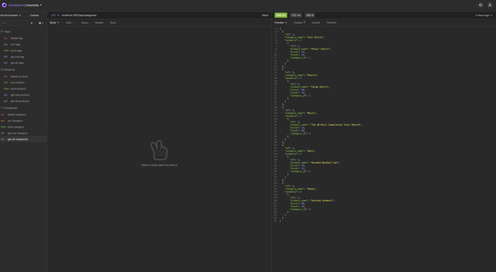

E-Commerce Back-End

## Description

This project will allow the user to read, create, update, and delete information from a database.

## Table of contents

- [Description](#description)
- [ScreenShot](#screenshot)
- [ScreenCast](#screencast)
- [Installation](#installation)
- [Usage](#usage)
- [License](#license)
- [Questions](#questions)

## ScreenShot

## ScreenCast

https://drive.google.com/file/d/1zU4mHRKhWbkdmOfME6eg21PRuOlq3Wt6/view

https://drive.google.com/file/d/1X-CycaBojk2JZatb6hIHGNXguAj2NyUh/view

## Installation

To install necessary dependencies, run the following command:

npm install or npm i after you have cloned the repository

## Usage

npm start

## License

This project is licensed under the MIT license.

## Questions

If you have any questions about the repo, open an issue or contact me directly at keonakirby@gmail.com. You can find more of my work at https://github.com/Keonak
